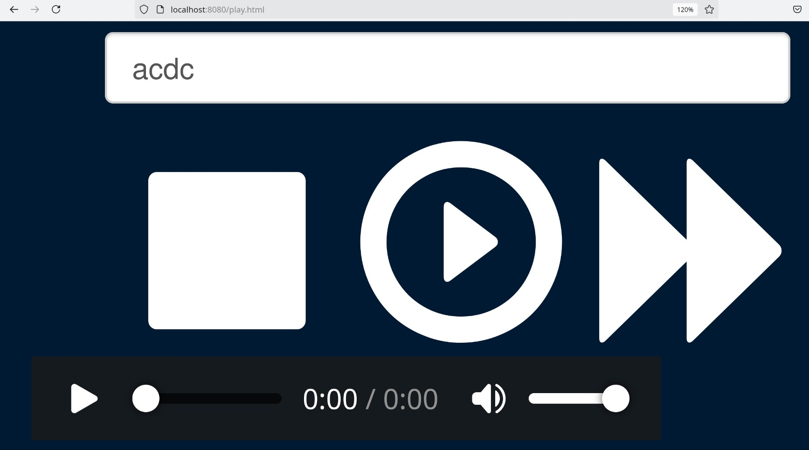

# Jukebox

Stream high quality audio from YouTube




## Requirements

- Python 3.13.2
- VLC
- FFMPEG

## Basic Usage

### Executing
1. Edit `playnow.txt`
2. Run:
   ```bash
   python3 play.py
   ```

## Linux Installation

### Python Setup
```bash
sudo apt install python3
sudo apt install pip
sudo apt install python3-psutil
```

### Running from Browser
```bash
sudo apt install apache2 php libapache2-mod-php php-sqlite3 php-pdo-sqlite
cd /Jukebox
php -S 0.0.0.0:8080
python3 play.py
```

Then browse to: `http://localhost:8080/play.html`

## Startup with one script

```bash
chmod +x play.sh
./play
```

## Smart Randomized Playlist

Install OpenAI dependencies:
```bash
pip install openai
export OPENAI_API_KEY="your_key"
sudo apt install pipx
pipx install openai
```

Or alternatively:
```bash
pip install openai --break-system-packages
```

## Local Radio Setup with Icecast2 Streaming

### Install and Configure Icecast2
```bash
sudo apt install icecast2
sudo nano /etc/icecast2/icecast.xml
```

Add the following configuration:
```xml
<listen-socket>
  <port>8000</port>
  <bind-address>0.0.0.0</bind-address>
</listen-socket>
```

### Optional: open it like http://jukebox:8080/play.html 
```bash
# sudo hostnamectl set-hostname Jukebox
Add jukebox to your /etc/hosts file:

#sudo nano /etc/hosts

Add this line (or edit an existing one):

127.0.0.1   jukebox

Then you can open http://jukebox:8080/play.html locally

```

### Setup Avahi Daemon for Network Discovery NOTE : Everything below is a Work In Progress
```bash
sudo apt update
sudo apt install avahi-daemon
sudo systemctl enable avahi-daemon
sudo chmod +x update-dns.sh
sudo ./update-dns.sh
```

### Configure Avahi
```bash
sudo nano /etc/avahi/avahi-daemon.conf
```

Add:
```ini
[server]
host-name=Jukebox
domain-name=local

[publish]
publish-addresses=yes
publish-hinfo=yes
publish-workstation=yes
```

### Start Services
```bash
sudo systemctl start avahi-daemon
sudo systemctl restart icecast2
```

## Further Reading and Optimization

For advanced YouTube downloading capabilities, see: https://github.com/yt-dlp/yt-dlp

---

*Enjoy streaming high-quality audio from YouTube with Jukebox!*
